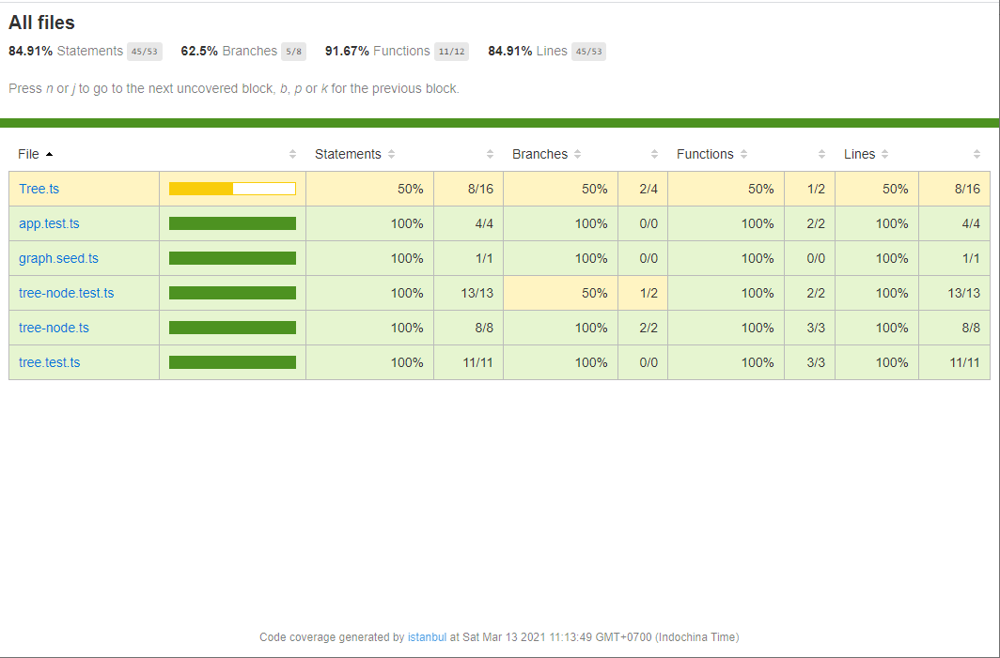

# 🛠 subgraph-finder
## 🚢 Status
- ❎ Project init from [nodets-playground](https://github.com/vub/nodets-playground)
- ❎ Node tree
- ❎ Unittest node tree
- ❎ Gen simple graph from array
- 🟩 Gen graph with multiple parent for node 
- ❎ Unittest for example graph
- 🟩 Unittest big graph


## 🍳 The correctness:

- ❌ I uncount the case of multiple parent for one node so that all the solution go wrong from generate the graph
- 🟩 My solution for find the biggest subgrpah from node is just new graph from this node:
  - I think there are no bigger node from one node in a tree, I call it a branch
  - The algorithm complexity is O(1)
  - performance should be good because O(1)

🍖 Trust be told I googling alot @@

## 🚦 I'll continue update the lib for later use...

## 🍜 How to use:

Run the app
```
yarn start
```

Test:
```
yarn test
```

Test coverage
```
yarn coverage
http-server ./coverage/lcov-report
```

### Coverage result

